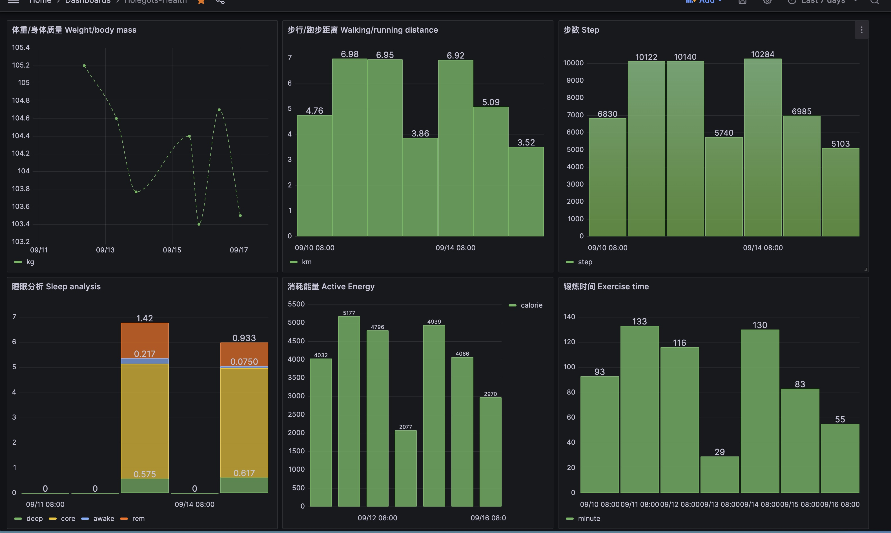
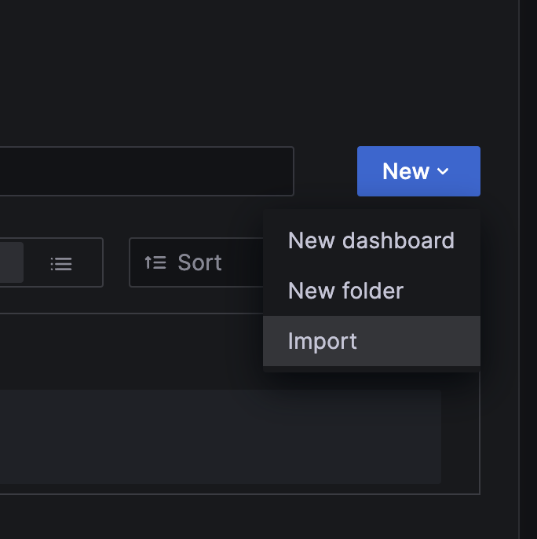
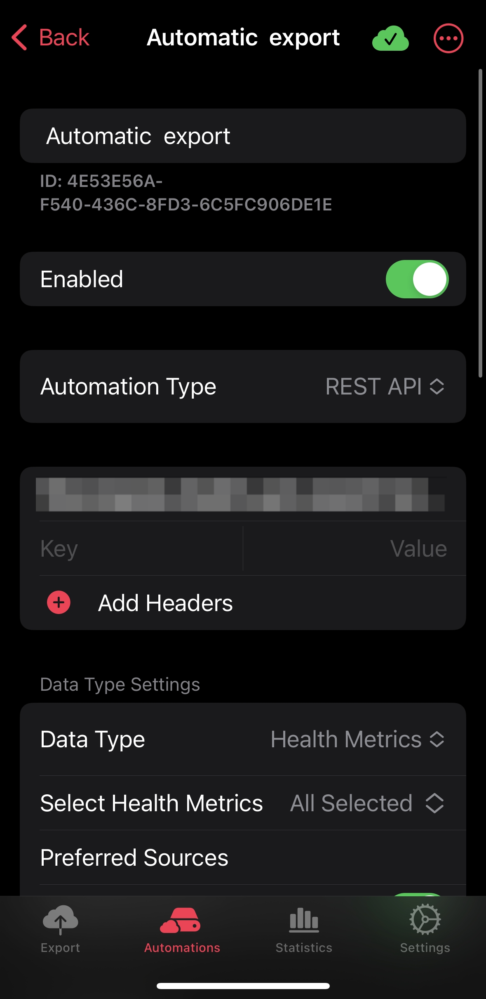

<h1 align="center">Welcome to apple-health-exporter 👋</h1>

<p>
  <a href="#" target="_blank">
    
  </a>
  <a href="https://twitter.com/fuergaosi" target="_blank">
    
  </a>
</p>

> Explore your apple health with Grafana


### 🏠 [Homepage](https://github.com/fuergaosi233/apple-health-exporter) | ✨ [Demo](https://grafana-health.y1s1.host/goto/egkRFfmIR?orgId=1)

[](https://railway.app/template/qZmI-e?referralCode=FaJtD_)

## Install

```sh
copy .env.example .env
# edit .env
docker compose up -d
```

## Config Grafana


1. Config Postgresql DB (Timescale)

1. Import `dashboard.json` to your dashboard

1. Enjoy it

## Start Sync data

1. Download `Auto Exporter` from App Store
2. Config Automations like this 

> You might have to pay for it. There's a not free app. You can use `Shortcuts` to do this. But I don't know how to do it. If you know, please tell me.  

URL is `<your domain>/upload`  
Such as   
 `http://localhost:8000/upload`  
 `https://xxx.railway.app/upload`  
  
3. Click `Update`

👤 **Holegots**

* Twitter: [@fuergaosi](https://twitter.com/fuergaosi)
* Github: [@fuergaosi233](https://github.com/fuergaosi233)

## Show your support

Give a ⭐️ if this project helped you!

***
_This README was generated with ❤️ by [readme-md-generator](https://github.com/kefranabg/readme-md-generator)_